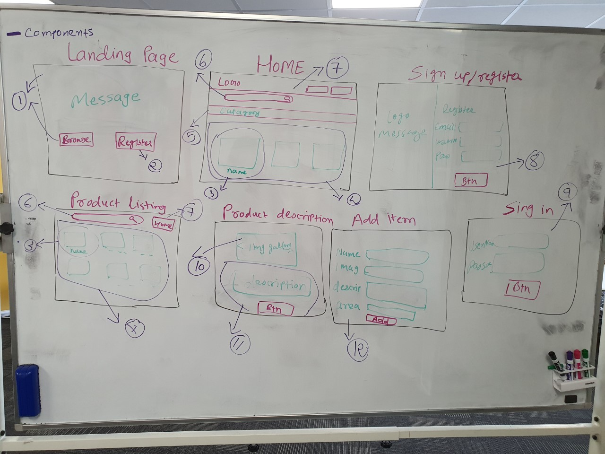
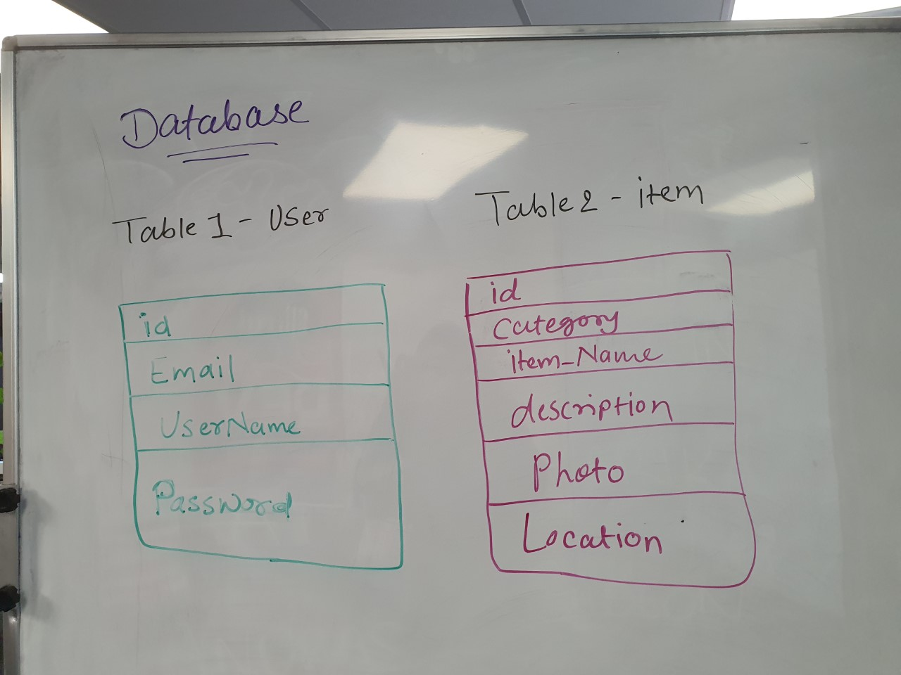
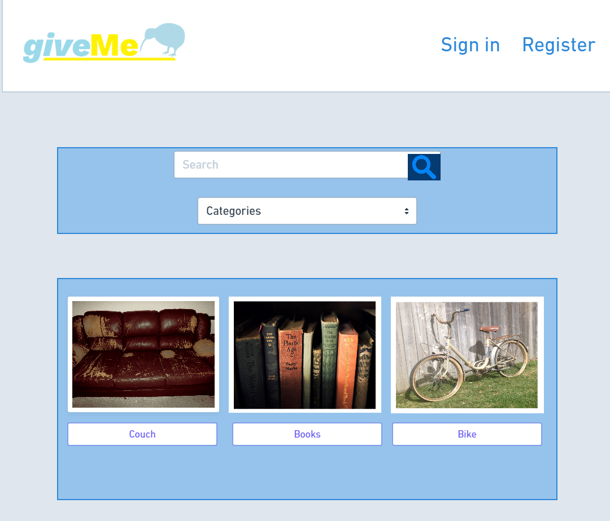
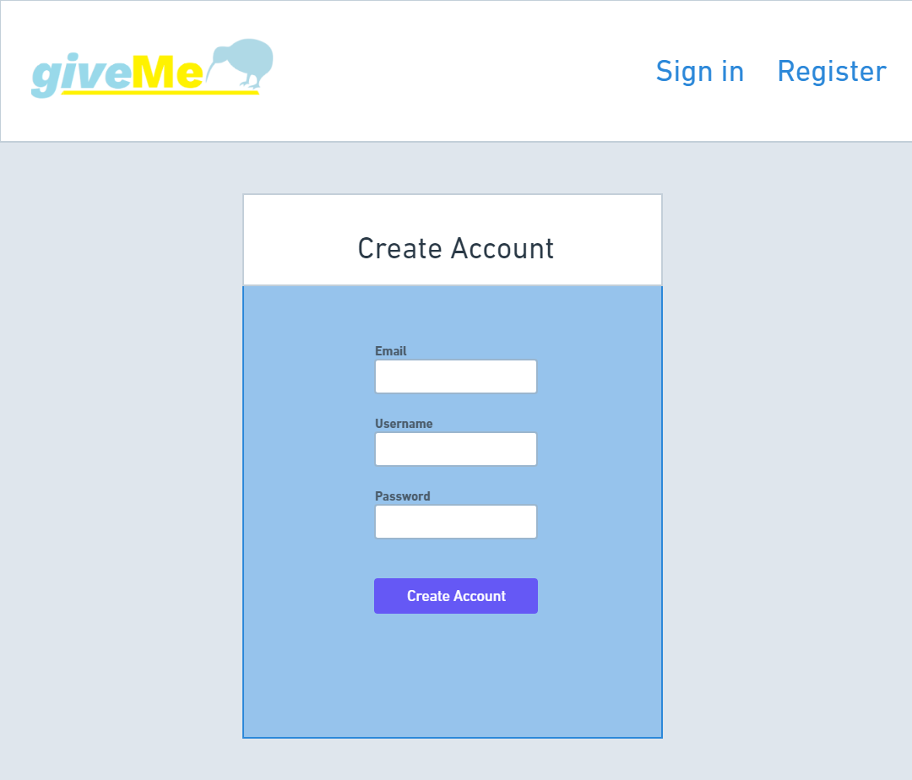
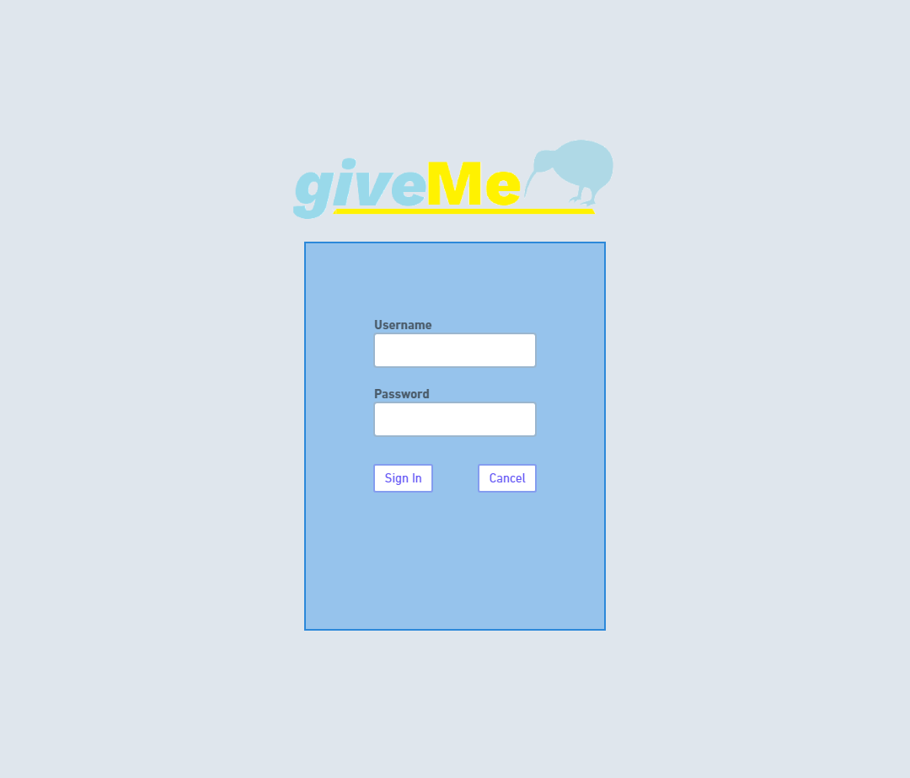
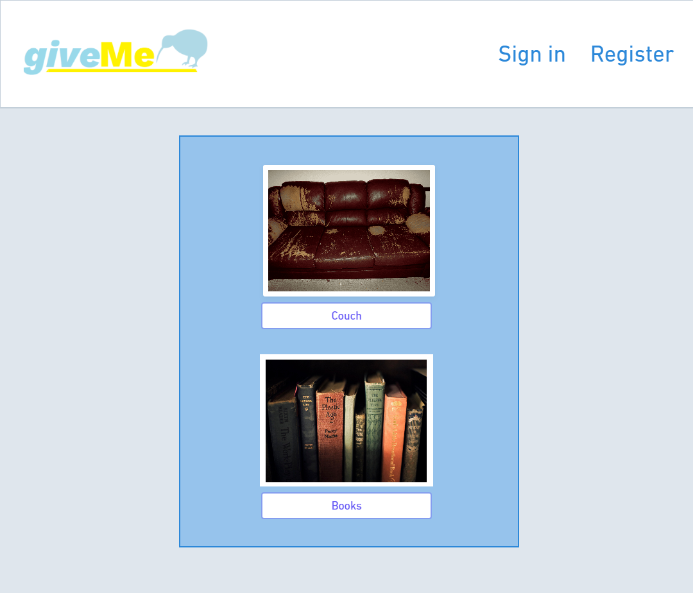
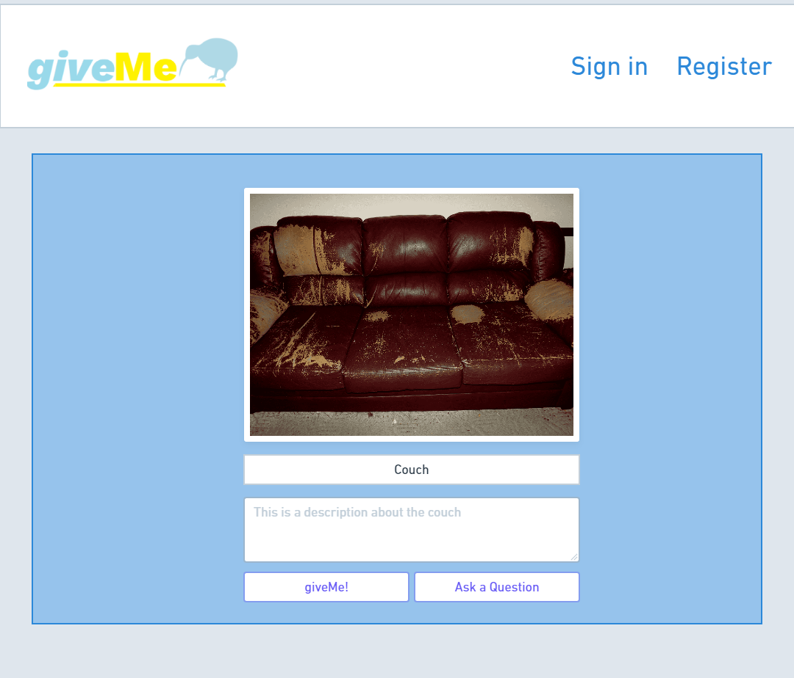
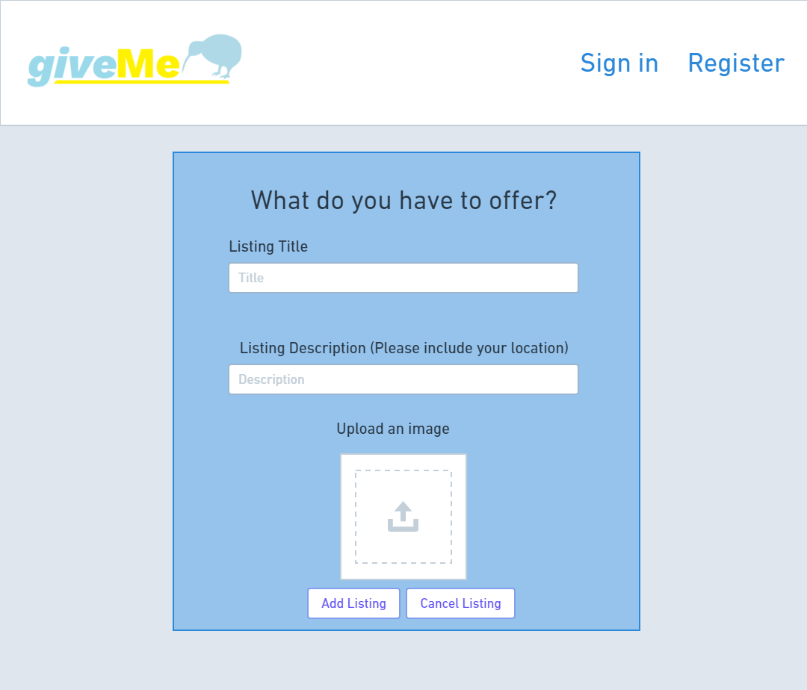
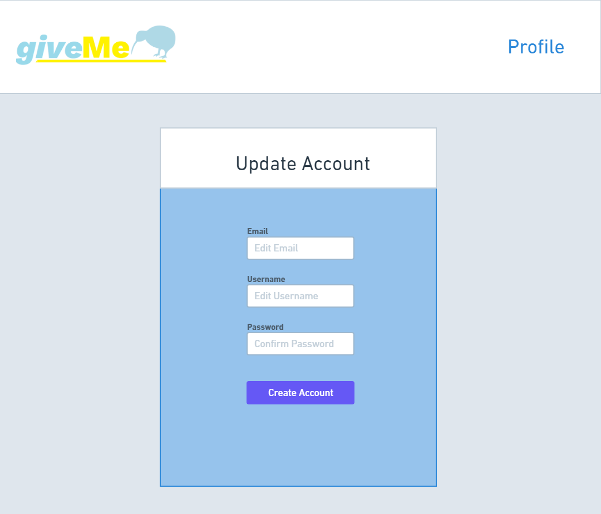

# GiveMe

> GiveMe is an online platform where kiwis can donate their unwanted items to other kiwis,
  empowering the NZ community to improve sustainability and reduce the waste caused by unwanted products.

## MVP
1. Has at least one product category. 
1. Sign in and register functionality 
1. Search bar
1. Form to Add/List item
1. Display items with description  
1. Inquire/Get button on a specific items listing page 
1. List view of products 
1. Notifiy listed item owner when someone uses the Enquire/Get button
1. Testing 

### CSS
Start with Bulma - to use Bulmas variables and classes please refer to the documentation https://bulma.io/documentation/

## Pages 
1. Sign in 
1. Register 
1. Landing page 
1. Home page 
1. Item list page 
1. Add/list item page 
1. item description page 
1. Edit user info page 

## Stretch 
1. Rating functionality 
1. Use SASS with Bulma 
1. Functionality to allow a user to ask questions about a specific item 
1. Grid view 
1. More categories 

## User stories 
1. As a user I want to be able to register. 
1. As a user I want to be able to sign in. 
1. As a user I want to be able to search for a specific item. 
1. As a user I want to be able to list an item to give away. 
1. As a user I want to be able to view an item with a description.
1. As a user I want to be able to update my profile. 
1. As a user I want to be able to inquire about an item I am interested in.

## Diagarm 

## User interface (proposal)

[Wireframe source on Whimsical](https://whimsical.com/DUMCHFWiwkCDuKRdxJXr1T)

.png)

